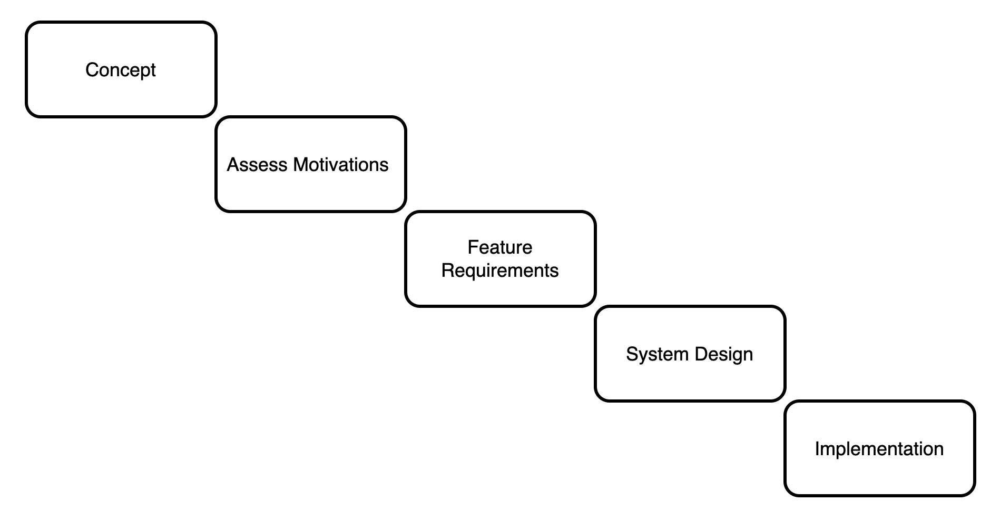

Inspired by a previous abstracted CS50 coursework project.

# Summary
A stock trading application with a detour exercise on cookie-session based authentication.

## Motivation
1. To exercise and assess my ability to deliver an application based on theoretical requirements while navigating the design and development process.
2. Strengthen autonomous problem solving capabilities.
3. Practice writing documentation by adhering to an engineering journal.

## Development Process

As a solo project, I adhered to a Waterfall methodology rather than Agile.

Reasoning:
* The app is simple enough that we should be able to chart a course to completion without much complexity.
* Having a concrete design document allows us to stay oriented in our development process.
* Completing the design beforehand allows for identification of potential blockers or timesinks.
* We don't expect major feature changes or redesigns at any point in the process.

Downsides:
* Failing to accomodate for something in the design phase can lead to complex refactors.
* Lack of flexibility makes adding features potentially more difficult.
* Upstream changes might require compounding system redesigns.

